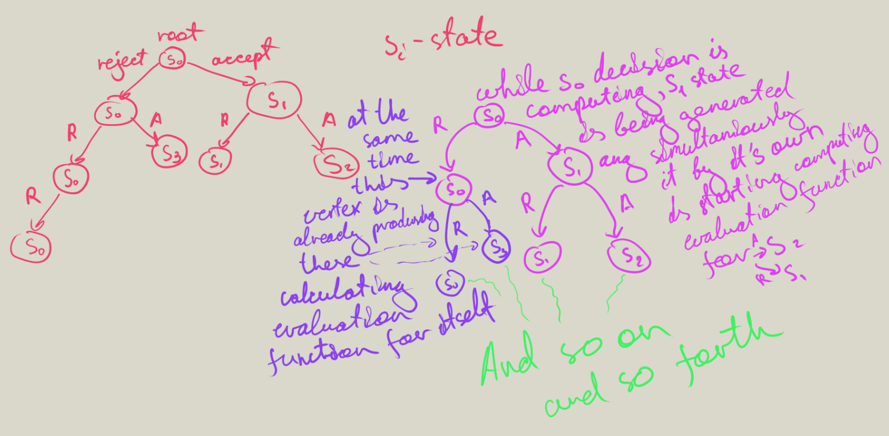
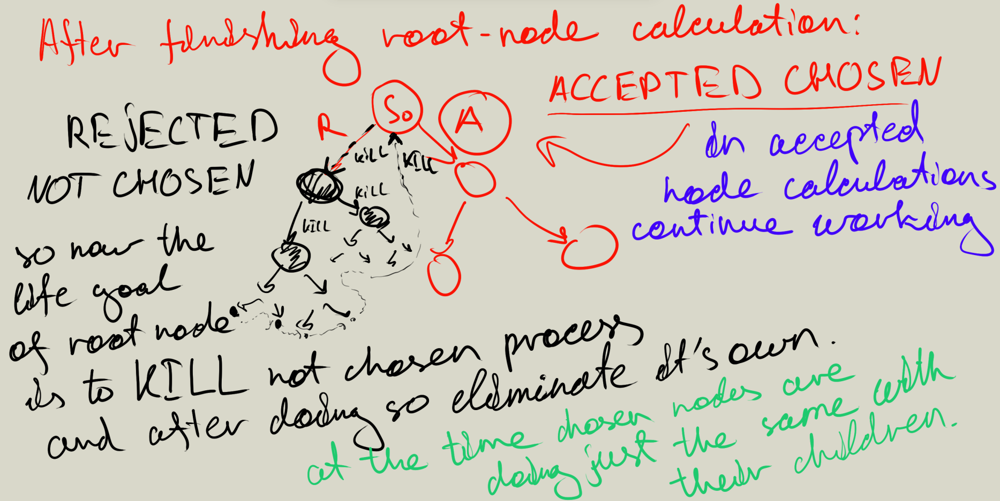

# Annealing Library (discrete version)


## Annealing algorithm in general
https://en.wikipedia.org/wiki/Simulated_annealing

## Parallel Simulated Annealing _(only for not sequential evaluation functions)_
How to speed up annealing algorithm with the most efficiency. The answer is not really perplex: adding multithreading.
The problem is in the core idea of the algorithm.
It is not like local optimization, where you ("land on the surface in random places") generating many random initializations and then protruding to the local minimum from each one.
In this case parallel idea is extremely simple, just computing each way after landing in parallel.
But in our case it is something different. Annealing requires us to use sequential computations because all the states of the algorithm are being generated by the previous ones.
Each state has two options:
1) apply changes (accept)
2) stay untouched (reject)

Initial state is generated only one time.

So we can not compute the next state without being sure that it would be chosen, or can we?
So the idea is to use the technique of speculative computations in which work is performed before it is known whether it is need.

#### First algorithm (inefficient)
Initially we will start with root node and only one process after generating it we will generate two new nodes - rejected and accepted.
Each node represents its own thread and will be denoting the root one but for its subtree, so its functions are the same, and it has same is root behaviour.
In general, it is independent.

Accepted node is a new state and rejected is the same as its parent (but with other temperature it is changing no matter what type the node is).
So now these nodes are behaving independently while root node is calculating evaluation function (the heaviest part of computations).
When root node finishes with its work it decides what child to choose.
Now only goal that remains for root node is to kill not chosen child process and all of its subtree.
So root process goes through all of not chosen child subtree and kills all its processes or another approach is to kill only child and then it will kill its own and so on.
Finally, root node process should eliminate itself.

This algorithm is not efficient enough. In this tree rejected edges grows much faster than accepted so it won't be enough threads to cover all the vertices that we need (particularly this thing is fixable).
Moreover, killing processes is excessively large amount of work. And with the number of threads growing the optimization is getting less efficient. 

#### Algorithm that I use in this project

Let's generate a tree containing as many vertices as threads our machine obtain, the structure of this tree depends on the level of temperature that we have at the current moment.
Higher temperature more `accented` vertices, lower - more `rejected`. It's easy to implement using the basics of probability theory: just by choosing what leaf to generate and after generating deleting it from a structure and adding its own children-leafs.
As we have done so only thing that remains is to start computations on all of these nodes. After parent node has finished his calculations we will add an edge between him and a chosen child in a figurative tree.
After doing so with all the parents we will get a path from the root node in this tree. We will stroll it, and arise in the final state of the current operation.
From that point we will loop the algorithm.
It works fine consuming only one communication action per process, furthermore it is adaptive and on lower temperatures it will be performing without any loss of efficiency.

## Usage instruction :)

Initially you should modify a `State` structure for your demands.
`State` structure's function `generate_new_state` should be filled and `f` value have to be always correct, it's the result of the function that evaluates how good current state is (smaller - better).
You can create your own constructor.

**!!! If you are using `unsequential_annealizer`, you do not have to maintain `f` variable, it will always be calculated by `F()` function.
Moreover, if you have much more efficient way to sequentially calculate `f` than just manually calculating it with `F()`, use standard `annealizer`, it will be more efficient.**

Example
```c++
template <typename T, typename G>
struct State {
    G f;
    int n;
    vector<int> perm;
    State() = default;
    State(int n): n(n) {
        mt19937 rnd(55);
        perm.resize(n); iota(perm.begin(), perm.end(), 0); shuffle(perm.begin(), perm.end(), rnd);
        f = F();
    };
    State(int n, vector<int> perm): n(n), perm(move(perm)) {
        f = F();
    }
    State<T, G> generate_new_state(random_generator<T>& gen, double t) {
        vector<int> nperm = perm;
        int i = gen.gen(n/2, t, 0, n-1);
        int j = gen.gen(n/2, t, 0, n-1);
        swap(nperm[i], nperm[j]);
        return State<T, G>(n, nperm);
    }
    T F() {
        f = 0;
        for (int i = 0; i < n; ++i) {
            for (int j = i+1; j < n; ++j) {
                if ((j-i)+perm[i] == perm[j] || (i-j)+perm[i] == perm[j]) f++;
            }
        }
        return f;
    }
};

State<int, int> instance(n);
```

1) If you don't have already prepared hyperparameters) after that call `autoSearch` function with first parameter = `instance` and second = how many seconds you can afford to spend on the final calculations (after setting all parameters). You'll receive the best hyperparameters and the best state that the algorithm has achieved.
```c++
State<int, int> instance(n);
instance = autoSearch(instance, 2.);
```
2) if your aim is just in running annealing algorithm) use `annealizer` constructor for setting hyperparameters and then run `anneal` function to get the best state that the algorithm has achieved.
```c++
State<int, int> instance(n);
annealizer<int, int> descent(instance, 30000, 0.9, 4, 1, 2, 0.99, 0, 0.02);
instance = descent.anneal();
```
3) if your aim is just in running annealing algorithm in parallel and you have unsequential evaluation function
```c++
State<int, int> instance(n);
unsequential_annealizer<int, int> descent(instance, 30000, 0.9, 4, 1, 2, 0.99, 0, 0.02);
instance = descent.anneal();
```


**_Toggling #define ASYNC 1/0 you can choose whether you want multithreading in you program (1) or not (0)._**

_to use multithreading you may have to use this flag for code compilation:_
```cmake
set(CMAKE_CXX_FLAGS "${CMAKE_CXX_FLAGS} -pthread")
```
```shell
g++ -std=c++17 -pthread main.cpp
```

## Resources
https://www.sciencedirect.com/science/article/pii/0895717789902021

https://www.math.spbu.ru/user/gran/sb1/lopatin.pdf

https://dl.acm.org/doi/pdf/10.5555/1882757.1882790